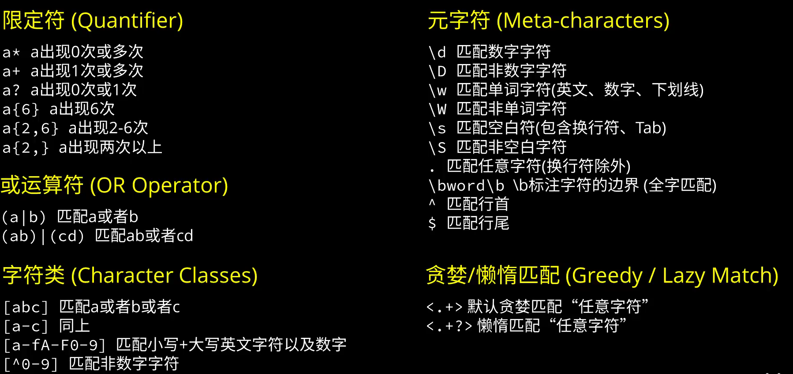

# 正则表达式

### 限定符(一个字符)

```sh
?		# 匹配前面的字符 0次或1次
*		# 匹配前面的字符 0次或多次
+ 		# 匹配前面的字符 1次或多次
{2,6}	# 指定前面的字符出现的次数 范围
{2,}	# 表示出现两次以上
{2}		# 表示出现两次
```

### 多个字符

```sh
(ab)+		# 匹配ab字符  1次或多次
(ab|bc)		# 或运算符，必须要加括号
[abc]+		# 代表匹配的字符只能取自于方括号里面的字符
[a-z]+		# 可以指定字符范围 (A-Z  0-9)
[^0-9]+		# 匹配除了 ^ 括号后面字符的所有字符 ，这里代表所有的非数字字符 (包括换行符) 
```

### 元字符

```sh
\d		# 数字字符 等同于 [0-9]
\D		# 非数字字符	等同于 [^0-9]
\w		# 单词字符 也就是英文字符+数字+下划线
\W		# 非单词字符
\s		# 代表空白字符 同时包含 Tab 及 Enter
\S		# 非空白字符
\b		# 单词字符的边界
.		# 代表任意字符 但不包括换行符
^		# 匹配行首 如 ^a  只会匹配行首的a
$ 		# 匹配行尾 a$ 只会匹配行尾的a
\.		# 使用\加特殊字符 可以匹配特殊字符
```

### 贪婪与懒惰匹配

正则表达式中默认是贪婪匹配

```sh
<.+>		# 会全部匹配，因为. 会尽可能多的去匹配字符串
<.+?>		# 会将贪婪匹配切换为懒惰匹配 就只会匹配尖括号了 <span>
<span><b>this is a sample text</b></span>
```

### 例子

```sh
#[a-fA-F0-9]{6}\b		# 匹配RGB颜色

\d+\.\d+\.\d+\.\d+		# 匹配ip地址  但是没有限定数字大小 256也可能会匹配上

\b((25[0-5]|2[0-4]\d?[01]?\d\d?)\.){3}(25[0-5]|2[0-4]\d?[01]?\d\d?)\b		# 设置了ip每位数字的限定范围


```



