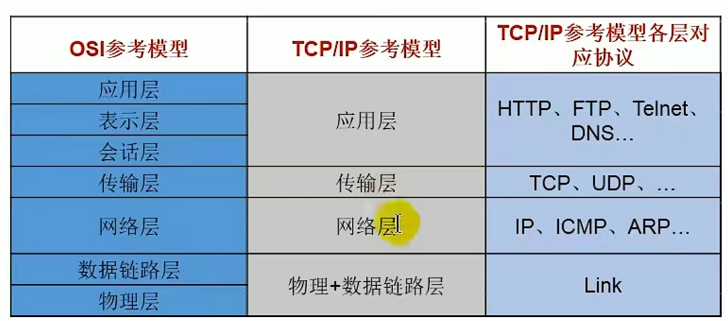
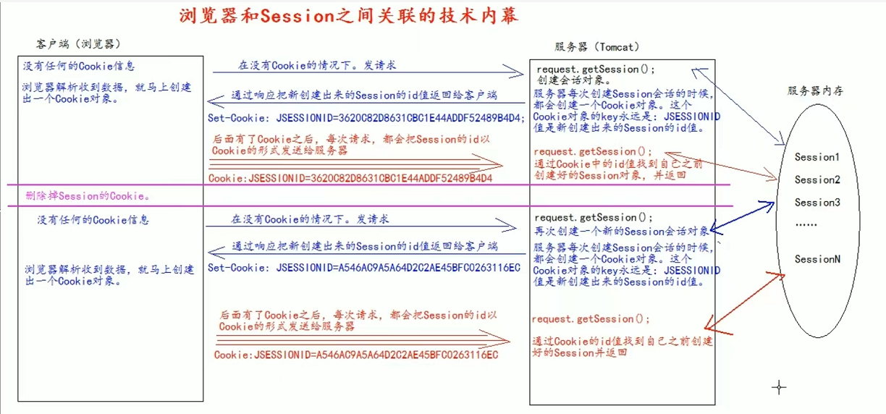

# RUNING 

## 浏览器

#### 网络通信协议



#### 浏览器和session的关联




## 语言和技术

### Java

#### 集合

> HashMap

解决hash冲突使用链地址法，就是将hash冲突的k-v用链表存起来

* hash冲突解决办法
  * 链地址法，优点处理冲突简单，无堆积现象，缺点查询效率低
  * 再哈希法，使用多个hash函数进行hash，第一个hash函数冲突了就用第二个，优点不易聚集，但是增加了计算时间
  * 建立公共溢出区，将哈希表分为基本表和溢出表，产生hash冲突的就放入溢出表
  * 开放定址法，当出现哈希冲突时，以某个东西为基础产生另一个哈希地址，线性探测再散列：顺序查找下一个单元；二次(平方)探测再散列：在表的左右进行n的平方跳跃式探查；伪随机探测再散列：已某个随机数为起点探测，直到找出一个空单元或查遍全表

### Linux

#### 查找bug的命令

```bash
# 这三个可以查看运行的jar的进程id(pid)
./jre/bin/jps
./jre/bin/jcmd
ps - ef|grep jar

# 然后使用jstack命令，就可以查看堆栈信息了
./jre/bin/jstack pid
# 也可以使用，把堆栈信息输入到dump.log文件中  下载到本地进行分析
./jre/bin/jstack pid >> /xxx/xx/x/dump.log

# 安装vim命令
apt-get install vim
```


## 框架

### Spring

#### Spring创建Bean的过程

或者Bean的生命周期

1. 通过构造器创建bean实例（无参构造函数）
2. 为bean的属性设置值和对其他bean引用(调用set方法)
3. 把bean实例传递到bean的后置处理器的方法postProcessBeforeInitialzation
4. 调用bean的初始化的方法（需要配置初始化方法），给方法上加`@PostConstruct`注解、实现InitializingBean接口并重写AfterPropertiesSet方法、或者通过xml配置 init-method属性配置；执行顺序依次是1->2->3
5. 把bean实例传递到bean的后置处理器的方法postProcessAfterInitialzation
6. 现在bean就可以使用了，可以从spring容器中获取
7. 当容器关闭的时候，调用bean的销毁的方法(需要配置)，实现DisposableBean接口并配置destory方法，或者在xml中配置destory方法

#### Spring 中AOP原理


### SpringMVC

#### SpringMVC执行流程

1. 用户向服务器发送请求，请求被SpringMVC的前端控制器DispatcherServlet捕获
2. DispatcherServlet对请求URL进行解析，得到请求资源标识符URI
3. 根据该URI调用HandlerMapping获得该Handler配置的所有相关信息(包括handler对象和对应的拦截器)
4. DispatcherServlet根据获取的handler，选择合适的HandlerAdapter
5. 成功获取到就开始执行拦截器的preHandler()方法（正向）
6. 然后提取request的参数，填充进handler，然后开始执行对应handler(Controller)的方法；在填充参数的时候spring会做一些额外的工作，如数据转化、数据格式化、数据验证等
7. handler执行完之后会返回一个ModalAndView对象
8. 此时开始执行拦截器的postHandler()方法（逆向）
9. 根据返回的ModalAndView选择合适的ViewResolver视图解析器进行解析，根据Modal和View渲染视图
10. 渲染完视图执行拦截器的afterCompletion()方法（逆向）
11. 将渲染结果返回给客户端

### SpringBoot

#### Web原生组件注入（Servlet、Filter、Listener）

1. 使用ServletAPI

@ServletComponentScan(basePackages = **"com.atguigu.admin"**) :指定原生Servlet组件都放在那里

@WebServlet(urlPatterns = **"/my"**)：效果：直接响应，**没有经过Spring的拦截器？**

@WebFilter(urlPatterns={**"/css/\*"**,**"/images/\*"**})

@WebListener


推荐可以这种方式；


#### SpringBoot的默认数据库连接池HikariCP为什么怎么快

> 连接池

主要考虑是一下经常创建的对象 的创建和销毁会造成很多资源的浪费，比如像线程资源、数据库连接资源或者 TCP 连接等，这类对象的初始化通常要花费比较长的时间，如果频繁地申请和销毁，就会耗费大量的系统资源，造成不必要的性能损失。这个时候我们可以通过一个虚拟的池子来保存这些对象，来管理这些对象的创建和销毁

>HikariCP为什么这么快

* 优化并精简字节码

使用第三方的java字节码修改工具javassist来生成动态代理类，因为其速度更快，相比于jdk生成的动态代理字节码更少

* 使用更好的并发集合类ConcurrentBag实现

是一个专门为连接池设计的集合，有更好的并发性能，内部使用ThreadLocal和CopyOnWriteArrayList存储元素，先从当前线程的ThreadLocal中获取当前线程的数据避免锁竞争，没有再从共享的CopyOnWriteArrayList中获取数据

* 使用FastList代替ArrayList

ArrayList每次调用get()方法时都会进行rangeCheck检查索引是否越界，FastList的实现中去除了这一检查，只要保证索引合法那么rangeCheck就成为了不必要的计算开销(当然开销极小)。通常情况下，同一个Connection创建了多个Statement时，后打开的Statement会先关闭。ArrayList的remove(Object)方法是从头开始遍历数组，而FastList是从数组的尾部开始遍历，因此更为高效

### Mybatis


